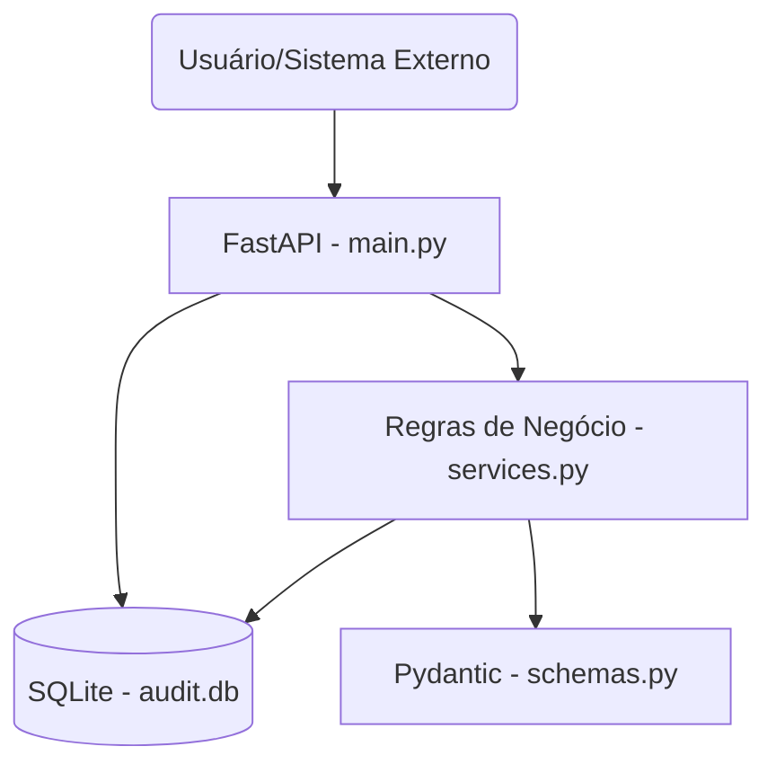
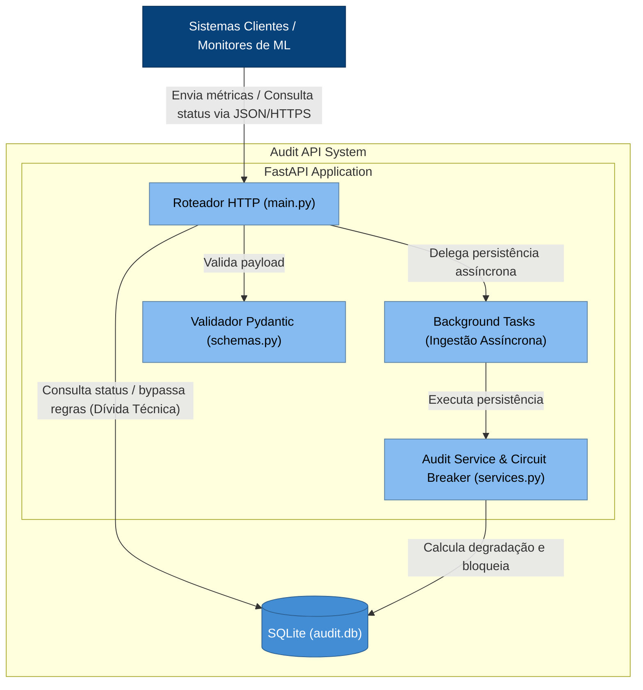

# Etapa 5: Documentação como Contrato (Diagramas C4)

## Versão 1: Diagrama Básico (Prompt Genérico)
**Prompt utilizado:** "Gere um diagrama C4 da arquitetura atual do projeto."

## Versão 2: Diagrama Refinado (Prompt Contextualizado com Padrão C4)
**Prompt utilizado:** "Gere um diagrama C4 Container em Mermaid da nossa API. Separe explicitamente o contexto do usuário, os limites do container da API e os componentes internos (Rotas, Background Tasks, Serviços de Degradação) e a base de dados. Use a sintaxe nativa do Mermaid."

## Comparação das Versões (Tarefa 14)
A **Versão 1** foi gerada de forma simples e apenas espelhou a árvore de arquivos, criando setas genéricas sem especificar a intenção da comunicação. Ela falha em documentar eventos críticos, como as *Background Tasks*.
A **Versão 2** (Refinada com ajuste manual e fornecimento de contexto) exibe os detalhes da arquitetura de forma superior. Ela delimita a fronteira do sistema (`SystemBoundary`), utiliza um esquema de cores padrão C4 e, o mais importante, documenta visualmente a dívida técnica atual: a seta direta entre o `Router` e o `Database` ilustrando o vazamento de responsabilidade discutido no ADR 0001.